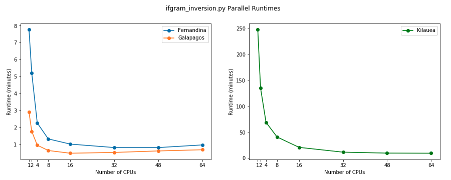

# Notes on how to run and configure Dask and Dask-Jobqueue

Dask and dask-jobqueue (`dask` and `dask_jobqueue`) are two libraries, both maintained by the dask organization, that provide the ability to run python code in parallel across multiple machines or across multiple computing cores on a single machine. The base `dask` library provides wrappers around two common python libraries (`numpy` and `pandas`) that allows for many of the common computations performed with these libraries (such as data transformations on large datasets or matrix inversions on large matrices) in parallel. Meanwhile, `dask_jobqueue` adds the ability to submit data and python commands to an HPC job scheduler (such as `LSF` or `SLURM`). In both cases, `dask` completely handles waiting for each task to complete (there is no longer any guarantee that they finish in the same order they were submitted) as well as properly merging the outputs back together. 

In `MintPy`, `dask_jobqueue` is utilized to dramatically speed up the runtime of complex calculations when running `MintPy` on an HPC cluster with a valid job scheduler. A host of various configuration parameters that determine the amount of computing resources that allocated to each dask “worker job” by the job scheduler can be specified in a dask configuration file, found at: `~/.config/dask/dask.yaml`.

`MintPy` currently supports utilizing dask in two ways: locally on a single machine with multiple CPU cores, and via a distributed HPC scheduler. The required options and recommended best practices for each differ slightly and are covered in the following section.

### Running Dask Locally using LocalCluster
Dask has the ability to utilize multiple CPUs (also known as "cores") running on the same physical machine to parallelize computations. This is the best way to use dask is you are running `MintPy` on a local machine with multiple available cores, or if you have access to an HPC cluster but wish to allocate only a single node's worth of resources towards MintPy but still take advantage of multiple cores. To use dask in this way, simply set the following options in `smallbaselineApp.cfg`:

    mintpy.networkInversion.parallel   = yes
    mintpy.networkInversion.cluster    = local

The number of cores that are allocated to dask can be controlled using the `mintpy.networkInversion.numWorkers` option in `smallbaselineApp.cfg`. This parameter can be specified as any positive integer, which will be taken as the number of CPUs you would like to allocate to dask. If you would like to unconditionally allocate all available CPUs on the computer to dask, you can set: 

    mintpy.networkInversion.numWorkers = all
    
 which will then allocate `multiprocessing.cpu_count()` number of workers to the dask computation. The default number of workers for LocalCluster is 4.
 
 Below is a figure depicting the running time of three datasets (Galapagos, Fernandina, and Kilauea) versus the number of allocated cores when running with the LocalCluster. These tests were conducted in May 2020, on the Stampede2 cluster, using 1 compute node from the 'skx-normal' queue ([node details here](https://portal.tacc.utexas.edu/user-guides/stampede2#overview-skxcomputenodes)). Dask options were as follows:
 
    mintpy.networkInversion.parallel    = yes
    mintpy.networkInversion.cluster     = local
    mintpy.networkInversion.config      = auto
    mintpy.networkInversion.numWorkers  = ____ # varied by test
    mintpy.networkInversion.walltime    = auto
 
| Property              | Fernandina Dataset | Galapagos Dataset | Kilauea Dataset            |
|-----------------------|--------------------|-------------------|----------------------------|
| Input File Size       | 0.623 GB           | 0.233 GB          | 15.0 GB                    |
| Dask Configuration    | None               | None              | None                       |
| Cluster Memory Used   | 16 GB              | 16 GB             | 16 GB (64 GB for 1-2 cores)|
| Chunk Size Used       | 100e6 (1 GB)       | 100e6 (1 GB)      | 100e6 (1 GB)               | 
 

### Running Dask using an HPC Cluster

#### Common Configuration Parameters ####

**name** - This is the name of the worker job as it will appear to the job scheduler. Any values are perfectly fine.

**cores** - this is the total number of cores you would like your parallel code to use. Note that this is not the number of cores per job or per worker, but the TOTAL number of cores you code can possibly use. It is recommended to check with your HPC cluster admin, or your HPC cluster documentation to find the number of cores that are available per compute node on your system. The value of this parameter is not recommended to exceed the total cores per compute node. *Note that this is a required parameter for dask_jobqueue cluster objects and must have a non-null value.*

**memory** - this is the total amount of memory you would like your code to use. Like the `cores` parameter, this is not memory per job or per worker, but total memory you code could use, and it is recommended to check what the maximum memory available on a compute node on you system is before setting this value. For `MintPy` is recommended to set this to a reasonably high value so as to ensure the dask workers do not run our memory while performing their calculations, which will result in the processing routine failing. A good metric found by testing on several `SLURM` clusters is to allocate at least 2GB of memory per core for smaller datasets (such as the `MintPy` test data) and as much as 5GB per core for much larger datasets. *Note that this is a required parameter for dask_jobqueue cluster objects and must have a non-null value. For systems that do not use the —mem directive in their job specifications, please see the section on the ‘header-skip’.*

**processes** - this is the number of python processes you would like your code to use PER JOB. For compute nodes with many cores, each core can often handle multiple running processes at a time which allow for faster computations and lower running times, without effecting slowing down the queuing time by requesting additional physical resources (cores and memory). If left as `null`, this value will automatically be set to `~sqrt(cores)` so that the number of processes and threads per process are approximately equal.  Processes can be thought of as the number of workers a given compute core can handle simultaneously, so, by setting `processes: 1` as in the default `mintpy.yaml` file, each core handles a single worker at a time, and then begins working on the next one after completing the previous one. If `processes: 5`, each core works on 5 workers at a time, and begins handling another worker as soon as any one of the previous 5 have completed.  *It is generally recommended by dask to keep the number of processes low and instead to request additional physical resources, as specifying too many processes on some systems has been known to lead to failed jobs and workers.*

**walltime** - this is the maximum amount of your time your job is permitted to run on a compute node before it is killed by the node. Walltimes are required so as to ensure users and jobs cannot hog nodes for extended periods of time without doing any substantial computations. Most queues have maximum allowed compute times, after which still running jobs will be terminated, but this is often on the order of 48+ hours. It is recommended to use relatively short walltimes for `MintPy` (the test dataset uses `wall time: 00:30:00` (30 minutes)), but not too short, or your job may never connect to the dask scheduler and finish its computation (when in doubt, start small and work towards larger wall times as needed). Note that the walltime format changes slightly depending on the job scheduler that is in place on your HPC system. For `LSF` schedulers, walltime is accepted and expected to be in `HH:MM` format, while `SLURM` and `PBS` schedulers only accept walltime in `HH:MM:SS` format.  

**queue** - this the scheduler queue to submit your jobs to. Most systems have several different queues with different amounts and types of resources you can request. For this reason, it is important to check with your HPC cluster admin or documentation to determine the most appropriate queue to `MintPy` on and what resources are available on that queue. Requesting for more resources (core, memory, nodes, etc.) on a queue than are available often leads to your jobs being rejected from queue, and can, on some systems, lead to fines or account suspensions.

**project** - this is the project allocation associated with your account. Most HPC systems bill projects based on the amount of resources requested, or allocate projects certain allowances based on grants or other funding, so it is important to specify the proper project for your jobs to be associated with.

**interface** - this is the network interface being used by your HPC cluster. For all tested clusters, this has been the  `ib0` interface. Available network interfaces can be fond by running `ipconfig` on your login node.

**job-extra** - this allows you to specify additional scheduler parameters that are not support out of the box by dask. For example, some `SLURM` clusters require the presence of the `--nodes` SBATCH directive in order to be accepted by the job scheduler, but dask does not use this directive directly. It can instead be specified in the `job-extra` array, and will be written with the other directive at submit time.

*There are a multitude of other configuration options that can be specified to dask to further customize the way in which jobs are run and executed on your HPC cluster, but the above are the most commonly used ones for MintPy. For further details and info on possible config options, see the dask-jobqueue documentation*

#### Using `~/.config/dask/dask.yaml` configuration files

The `dask-jobqueue` cluster objects (`LSFCluster`, `PBSCluster`, `SLURMCluster`, etc.) accepts configuration parameters in two ways: (a) they can be passed directly to the object within the code, or (b) they can be specified in a `dask.yaml` file and be sourced by `dask` at runtime.  Option (b) is the way `MintPy` is designed to take these parameters. 

Per the `dask` and `dask-jobqueue` documentation, any `*.yaml` file placed within the `~/.config/dask/` directory will be sourced and used regardless of its name. By default, a `dask.yaml`,  `distributed.yaml`, and a `jobqueue.yaml` file are all created in this directory when `dask` is installed. A MintPy-specific ‘dask.yaml’ file is available as a part of the `MintPy` repository and can be found at `mintpy/defaults/mintpy.yaml`. It is recommended that you copy this file into the `~/.config/dask/` directory before running MintPy in parallel on your HPC system.

If you would like to not use the `~/.config/dask/` directory to store your configuration files for some reason, you can also set the `DASK_ROOT_CONFIG` environment variable to a custom directory which will searched be sourced after `~/.config/dask/`. Any `*.yaml` files found in this custom directory will be added to the dask configuration object and can be used with the dask-jobqueue cluster object. Note that, if a configuration is specified with the same configuration name in a yaml file in both the `DASK_ROOT_CONFIG` and `~/.config/dask/` directory, the parameters from the configuration in `~/.config/dask/` will be used.  **Note: it is generally not recommended to set a custom DASK_ROOT_CONFIG variable.**

Additionally, in the `dask.yaml` configuration files, individuals configurations can be named in one of two ways: (1) by the cluster type they apply to (`lsf`, `pbs`, `slurm`, etc.) or (2) by name (`stampede`, `comet`, etc.). It is can be useful to refer to the configuration by name if you are using `MintPy` are more than on HPC system, or if you hva different resource schemes you are using in different circumstances.

### Dask related options in `smallbaselineApp.cfg`

There are five options related to the dask features in `MintPy` that can be controlled via the `smallbaselineApp.cfg` file found in `mintpy/defaults/smallbaselineApp.cfg`. They are detailed below, along with default values and other notes:

`mintpy.networkInversion.parallel` - this is a simple boolean value that can be either ‘yes’ or ‘no’ indicating whether or not you would like to run the `ifgram_inversion` steps of the processing routine using dask or not. If ‘no’ a serial version of the function is performed. *Default: no*

`mintpy.networkInversion.cluster` - this is a string value that indicates what job scheduler your HPC system is using. Currently, valid options are “LSF”, “PBS”, “SLURM”, or "Local" and “Local” is used by default (as most users do not have access to a job scheduler to use othe scheduler options.). *Default: local* 

`mintpy.networkInversion.config` - this is the name of the configuration section of your `dask.yaml` file to use if any. By default, this value is ‘no’ indicating there is no special config name to use, in which case, dask uses the default config name for the cluster type specified.

`mintpy.networkInversion.numWorker` - this is the number of worker jobs you would like dask to run. If you are using the 'local' `cluster` option value, this will specify the number of CPU cores to allocate to dask (*Default: 4*). If you are using a job scheduler on an HPC cluster, this will specify the number of worker jobs to submit to the scheduler (*Default: 40*). To use all available CPU cores when using the 'local' cluster type, provide the value 'all', which allocates `multiprocessing.cpu_count()` cores to dask.

`mintpy.networkInversion.walltime` - this is a string value indicating the walltime to be used for each dask job. By default, this is "00:40”, which corresponds to 40 minutes. For LSF cluster, wall times are specified in HH:MM format, while PBS and SLURM cluster use HH:MM:SS format for wall times. In the event a wall time is specified that does not match the format desired by the cluster you are using, `MintPy` will attempt to convert the value to the appropriate format. 
